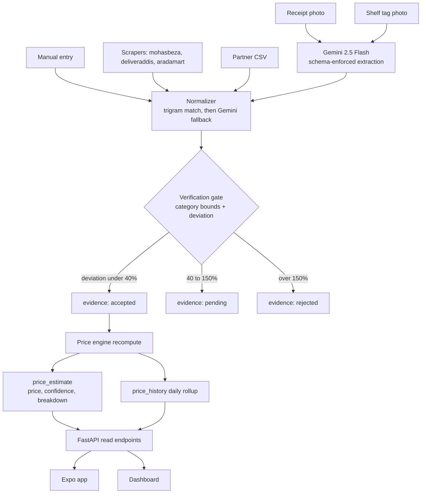

# SuqCheck: Evidence-Based Pricing Infrastructure

Technical design for SuqCheck, a pricing intelligence platform for Ethiopia: a FastAPI + Neon Postgres backend with a deterministic price/confidence engine, Gemini-powered receipt and shelf ingestion, an Expo consumer app, and a React analytics dashboard. Scoped to a 48-hour hackathon with four people.

## Core principle

`evidence` is the only table anyone writes prices into. No code path sets a price directly. A single deterministic engine derives `price_estimate` and `price_history` from evidence and persists its own reasoning. This is what makes the trust story real rather than decorative, and it is what lets every screen answer "why should I trust this number?"

## Scope

Supported: packaged household essentials only. Cooking oil, sugar, rice, flour, salt, pasta, coffee, tea, milk, soap, detergent, toothpaste, shampoo, bottled water. Every one has packaging, branding, labels, and appears on receipts, so extraction and normalization are tractable.

Deferred: fresh produce, eggs, meat, teff. Quality, weight, and freshness vary, so a single exact price is meaningless. These can be added later as ranges rather than point estimates.

## Stack

- Backend: FastAPI, SQLAlchemy 2.0, Alembic, Pydantic v2, Python 3.12
- Database: Neon Postgres with `pg_trgm` for fuzzy product matching
- AI: Gemini `gemini-2.5-flash` with enforced `response_format` JSON schema, `temperature=0.1`
- Mobile: Expo (expo-router, expo-camera, expo-location, react-native-maps, @tanstack/react-query, react-native-svg)
- Dashboard: Vite + React + Recharts, deployed as a Render static site
- Deploy: Render web service for the API, Render static site for the dashboard, Neon for the DB, Expo Go QR for judges

## Repo layout

- `contracts/openapi.yaml` and `contracts/fixtures/*.json` the shared boundary between the two coders
- `data/products.csv`, `data/stores.csv` researched by the non-coders, read by the seed script
- `backend/app/` with `api/`, `models/`, `schemas/`, `services/`, `seed/`
- `backend/scrapers/` one module per source plus a shared `ScrapedItem` contract
- `mobile/` Expo app
- `dashboard/` Vite app
- `docs/superpowers/specs/2026-07-25-suqcheck-design.md` the written spec

## Data model

- `product` - id, canonical_name, brand, category, size_value, size_unit, barcode, thumbnail
- `product_alias` - id, product_id, raw_text, normalized_text, source. Grows on every successful match so repeat receipts cost zero Gemini calls
- `store` - id, name, chain, district, lat, lng, kind (supermarket / shop / online)
- `evidence` - id, product_id, store_id, price_etb, source_type (partner / receipt / scrape / store_visit / shelf_photo / community), ocr_confidence, observed_at, status (accepted / pending / rejected), rejection_reason, raw_payload jsonb, thumbnail bytea
- `price_estimate` - unique on (product_id, store_id) where a NULL store_id means market-wide. Holds price_etb, confidence, evidence_count, store_count, spread_pct, newest_observed_at, breakdown jsonb
- `price_history` - unique on (product_id, day). Holds price_etb and evidence_count. Seeded with 60 days
- `category_price_bounds` - category, size_unit, min_etb, max_etb. Cheap sanity guardrail

Do not persist original upload images. A thumbnail under 64KB in `bytea` gives the audit trail without object storage, signed URLs, or extra deploy surface.

## Price engine (`services/price_engine.py`)

Per evidence row within a 30-day lookback:

- source weight: partner 1.0, receipt 0.9, scrape 0.75, store_visit 0.6, shelf_photo 0.55, community 0.4
- freshness weight: `0.5 ** (age_days / 7)`
- final weight: `source_weight * ocr_confidence * freshness_weight`

Market price is the weighted median of the set, not the mean, so a single fat-fingered entry cannot drag it. Spread is `(p75 - p25) / median`.

Confidence sub-scores, each clamped to 0 to 1:

- volume: `log(1 + sum_of_weights) / log(1 + 8)`
- agreement: `1 - (spread_pct / 0.25)`
- freshness: the maximum freshness weight in the set
- diversity: `distinct_stores / 3` for market-wide, `n / 2` for store-level

`confidence = 100 * (0.30*volume + 0.30*agreement + 0.25*freshness + 0.15*diversity)`, capped at 60 when freshness is below 0.3, because stale data can never be high confidence. Bands: 85+ high, 65 to 84 medium, below 65 low. The full sub-score breakdown is written to `price_estimate.breakdown` so the app's "why" panel renders stored facts rather than recomputing.

Recompute runs inline after each accepted evidence insert, scoped to the one affected product.

## Verification gate (`services/verification.py`)

1. Reject outright if outside `category_price_bounds`
2. If an estimate with confidence 60+ exists, compute `deviation = abs(p - estimate) / estimate`. Under 0.40 accepts, 0.40 to 1.50 marks pending, above 1.50 rejects with a reason string
3. With no prior estimate, bootstrap-accept

This produces the exact demo beat from the concept: a 120 ETB cooking oil entry lands in Pending Verification with a human-readable reason.

## Normalization (`services/normalize.py`)

1. Normalize the string, unify units (`1000ml` to `1L`)
2. Exact match on `product_alias.normalized_text`
3. `pg_trgm` similarity above 0.55 auto-matches
4. Otherwise call Gemini with the raw text plus the top five trigram candidates, structured output `{match: existing|new, product_id, brand, canonical_name, size_value, size_unit, confidence}`
5. Write the raw text back into `product_alias`

Step 5 is what makes "gets smarter over time" literally true: the second identical receipt costs zero Gemini calls, and that is demonstrable on stage.

## Gemini services (`services/ocr.py`)

- `extract_receipt` returns store_name, date, line items with raw_text and prices, ocr_confidence
- `extract_shelf_tag` returns raw_product_text, price, ocr_confidence
- `identify_product` returns brand, product_name, size for the camera search flow

Amharic receipts are the main accuracy risk. Mitigation: the app shows the extraction for user correction before submitting, which doubles as a trust feature.

## API surface (no auth, `X-Device-Id` header for dedupe and rate limiting)

- `GET /api/pulse` market metrics and movers, 60-second in-process cache
- `GET /api/products?q=&category=`
- `GET /api/products/{id}` price, confidence, breakdown, sources, history
- `GET /api/products/{id}/stores?lat=&lng=&radius=`
- `GET /api/stores/{id}`
- `POST /api/evidence/receipt` | `/shelf` | `/manual`
- `POST /api/scan/identify`
- `GET /api/analytics/trends` for the dashboard trends page. District averages feed the cheapest-district figure inside `/api/pulse`, and a separate `/coverage` endpoint is cut along with the dashboard page that would have consumed it
- `GET /healthz`

Rate-limit the upload endpoints per device and per IP. Combined with source weighting, anonymous community reports can never meaningfully move a price on their own, which is the answer to the inevitable abuse question.

## Scrapers

Shared `ScrapedItem` contract, one module per source, all writing evidence with `source_type=scrape`:

- `mohasbeza.py` - WooCommerce, try `/wp-json/wc/store/products?per_page=100&page=N` first
- `deliveraddis.py` - parse `/market/full`
- `aradamart.py` - Wix, extract embedded product JSON

Run via `python -m scrapers.run --source all`, politely rate-limited, respecting robots.txt. Commit a cached JSON snapshot so the demo never depends on a live scrape succeeding.

## Seed data

About 120 products across the 14 supported packaged categories, 46 stores across real Addis districts with plausible coordinates, and 60 days of evidence built from a per-product base price, a per-store multiplier of 0.92 to 1.08, a random walk, and a deliberate cooking-oil uptrend and sugar downtrend so Market Pulse has real movers.

Leave several products thin and stale on purpose. A confidence score that is always high proves nothing; the demo needs a genuine 76% sitting next to the 98%.

## Screens

Mobile: Pulse home, search results, product detail (big price, confidence ring, expandable why panel, store list, history sparkline, source list), scan, contribute with extraction review, nearby map.

Dashboard: three pages only, since one frontend developer owns both surfaces. Overview KPIs, a live ingestion log showing each evidence row with its source and gate decision, and trends. The ingestion log is what makes it read as infrastructure rather than a lookup table, so it survives even if trends is cut. The coverage-gaps, product-table, and districts pages are cut outright.

## Testing

Keep it minimal but the price engine is non-negotiable, since a silent bug there ruins the demo. Pytest cases covering weighted median, each confidence sub-score, the staleness cap, gate accept/pending/reject boundaries, and alias matching. Roughly 15 tests.

## Team split and timeline

Two coders (one backend, one frontend) plus two non-coders. Hour-by-hour tracks, shared-file rules, and non-coder assignments live in [split.md](split.md).

The load-bearing idea: a stub API returning fixture JSON is deployed in hour 2, so the frontend builds against the real URL from the start and the backend replaces fixtures endpoint by endpoint. There is no integration day.

## Risks and fallbacks

- Amharic OCR accuracy: user-editable extraction review screen
- Scraper breakage: committed JSON snapshot
- Camera on a judge's device: sample-image buttons alongside live capture
- Venue network: deployed URL plus a recorded video

