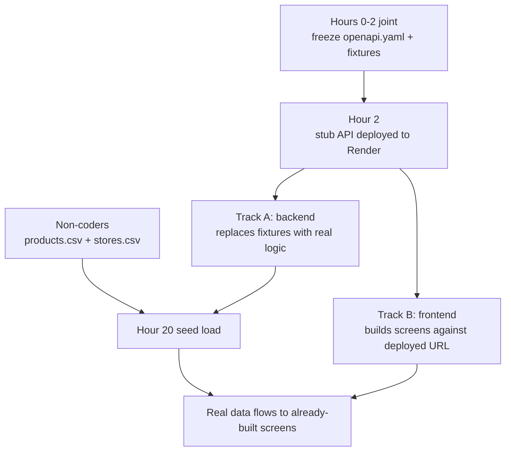

# SuqCheck: Two-Coder Work Split

How four people ship this in 48 hours when only two of them write code. Revises the team section of [plan.md](plan.md), which originally assumed four coders.

- Coder A, backend/Python: schema, price engine, verification gate, Gemini services, endpoints, seed loading, deploy
- Coder B, frontend/JS: Expo app, then the dashboard
- Non-coders C and D: catalog research, receipt collection, QA, pitch

## The mechanism: a deployed stub in hour 2

The reason two people normally block each other is that the frontend waits for endpoints. Remove that by shipping a FastAPI app in hour 2 where every endpoint returns a hardcoded fixture and nothing touches the database.

- Frontend points at the real Render URL from hour 2 and never runs a mock server
- Backend swaps fixtures for real implementations one endpoint at a time
- Deployment is proven on day one instead of discovered at hour 40
- If backend falls behind, frontend is degraded (stale fixture data) but never blocked

There is no integration day, because integration happens in hour 2 when there is nothing to integrate.

## Track A: backend, hour by hour

| Hours    | Work                                                                                                                                                 |
| -------- | ---------------------------------------------------------------------------------------------------------------------------------------------------- |
| 0 to 2   | Joint contract freeze                                                                                                                                |
| 2 to 4   | Neon provisioned, stub API returning fixtures deployed to Render, `/healthz` green                                                                   |
| 4 to 10  | SQLAlchemy models, Alembic migrations, `pg_trgm`, price engine with the four confidence sub-scores, pytest for the engine                            |
| 10 to 14 | Verification gate, then make the read endpoints real: `/api/pulse`, `/api/products`, `/api/products/{id}`, `/api/products/{id}/stores`               |
| 14 to 20 | Gemini `extract_receipt`, `extract_shelf_tag`, `identify_product`, normalization with alias write-back, the three `/api/evidence/*` ingest endpoints |
| 20 to 26 | Load `data/products.csv` and `data/stores.csv`, generate 60 days of evidence, backfill estimates and history, analytics endpoints                    |
| 26 to 32 | Scrapers, the designated cut                                                                                                                         |
| 32 to 40 | Rate limiting, QA bug fixes, hardening                                                                                                               |
| 40 to 48 | Buffer and demo support                                                                                                                              |

Order matters: read endpoints become real before ingest, because they carry the demo and are the cheapest to implement.

## Track B: frontend, hour by hour

| Hours    | Work                                                                                                               |
| -------- | ------------------------------------------------------------------------------------------------------------------ |
| 0 to 2   | Joint contract freeze                                                                                              |
| 2 to 4   | Expo scaffold, `openapi-typescript` generating `types.ts`, API client pointed at the deployed stub                 |
| 4 to 12  | Pulse home, search, and product detail                                                                             |
| 12 to 18 | Camera scan and the contribute flow with the editable extraction review screen, built against the fixture response |
| 18 to 22 | Nearby map and the history sparkline                                                                               |
| 22 to 30 | Dashboard, reduced to three pages: overview KPIs, live ingestion log, trends                                       |
| 30 to 40 | Loading, empty, and error states on the demo path only                                                             |
| 40 to 48 | Buffer and rehearsal support                                                                                       |

Product detail is the demo centerpiece, so it gets built first and polished last.

Coder B owns two surfaces while Coder A owns one, which makes frontend the real bottleneck. That is why the dashboard drops from six pages to three, and why its coverage-gaps and districts pages are cut outright.

## Do not share code between mobile and dashboard

Tempting to build a pnpm workspace with a shared API client. Do not. Metro and Vite resolution conflicts are a real risk and debugging one at hour 30 is fatal. Instead, a script copies the generated `types.ts` into both `mobile/src/api/` and `dashboard/src/api/`. Duplicated types cost nothing; a broken bundler costs the demo.

## Shared files, and the rule for each

- `contracts/openapi.yaml` - the only file both coders touch. Changes after hour 2 require both to agree, in person, and a fixture update in the same commit
- `contracts/fixtures/*.json` - what the stub returns and what the frontend sees until each endpoint is real
- `data/products.csv`, `data/stores.csv` - written by non-coders, read by the seed script. Backend needs these by hour 20

Everything else lives under `backend/` or `mobile/` and `dashboard/`, which never overlap, so both coders commit straight to `main` with small frequent pushes. No feature branches, no PR review; there is no time and the directories cannot conflict.

## Non-coders are on the critical path

They are not doing slides for 48 hours. They own the data that makes the demo credible.

- `data/products.csv`: about 120 real packaged products with brand, size, category, and a realistic ETB base price, researched from mohasbeza, aradamart, and deliveraddis. Due hour 16
- `data/stores.csv`: 46 real Addis stores with district and approximate lat/lng from Google Maps. Due hour 16
- Photograph real receipts and shelf tags around Addis, including Amharic ones, committed to `backend/tests/fixtures/images/`. Due hour 20. This is the only real OCR test data anyone will have
- From hour 30, act as QA against the deployed app and write the demo script

## Integration checkpoints

Every six hours both coders pull, push, and open the deployed URL together for ten minutes. At hour 30 the feature list freezes; after that, only bug fixes on the demo path.

## Cut order

1. Scrapers
2. Dashboard trends page
3. Nearby map
4. Everything else is demo-critical

